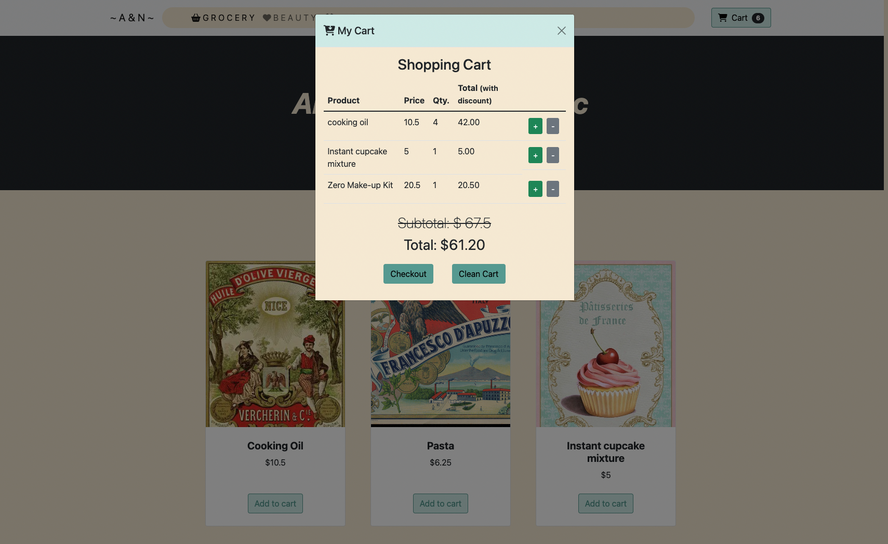

# 📄 E-commerce demo web of vintage-looking whole foods ✨
- Demo web to purchase products online, you can add and subtract products from the cart, offers also apply automatically and it allows to see the final price.

  

## 💻 Tech:
- HTML, CSS, SASS, Bootstrap, Javascript

## 📋 Requirements
- Supported Browsers (Chrome, Firefox, Safari...)
- Github

## 🛠️ Development Tools:
- Code Editor: VS Code
- Local Server: Live Server extension (for testing)
- ChatGPT (for corrections & bugs)

## Dependencies:
- Node.js
- Bootstrap
- SASS compiler
  
🤖 Clone this repo -> `git clone https://github.com/OhMyLaia/sprint2.2-E-commerce-remote.git`

## 🤝 Contributions:
- Fork the repository and clone it locally
- Create a new branch for your feature: git checkout -b feature/my-feature
- Stage your changes: `git add .` or  `git add *`
- Commit your changes: `git commit -m "Describe your changes"`
- Push the branch: `git push origin feature/my-feature`
- Open a Pull Request and wait for review 🫡
